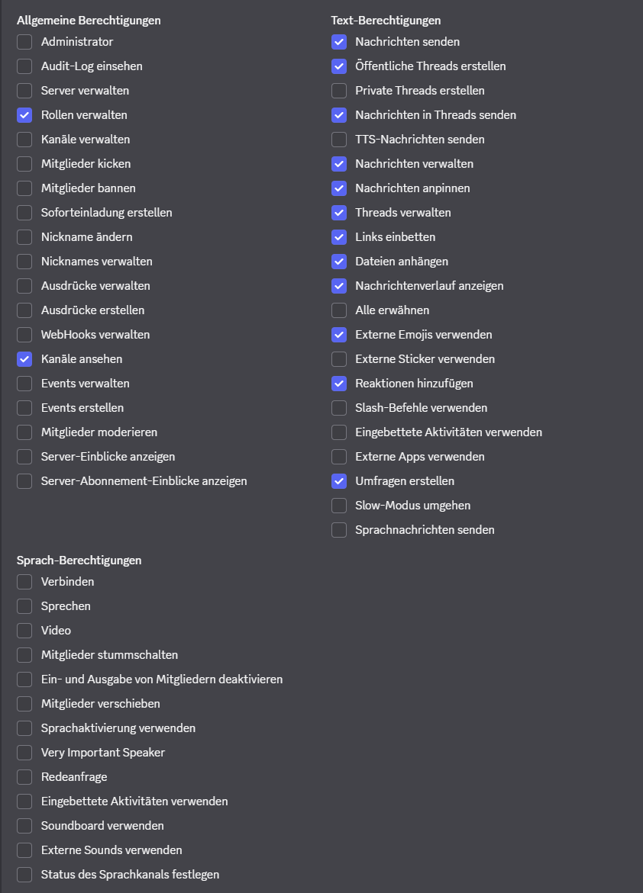

This project is documenting my attempt at coding a working Discord bot. The capability of this bot will be expanded further upon the first functioning version. The end goal is a bot that can manage a community discord for a client. Additional features include music streaming on-demand and using external applications to enable customers to book appointments with the client. 

-- Requirements --
1. Python 3
2. discord.py
3. python-dotenv
4. Visit https://docs.discord.com/developers/intro to create developer account
5. Invite link for this bot: https://discord.com/oauth2/authorize?client_id=1511371792403402853&permissions=2815076453444672&integration_type=0&scope=bot

-- Install dependencies --
1. pip install -r .\requirements.txt
or 
2. pip install discord.py
3. pip install python-dotenv

-- Set Up --
1. Create Discord bot on the developer page
2. Generate token 
3. Copy and paste the token into the .env file
NOTE: DO NOT LEAK THE TOKEN 

For anyone copying this repo: .env file is set up like this:
DISCORD_TOKEN=**YOURTOKEN**

4. Toggle "Server Members Intent" and "Message Content Intent" on the developer bot page
5. 0Auth2 URL-Generator set to "Bot"
6. Set permissions 
7. API&intent documentation: https://discordpy.readthedocs.io/en/stable/
